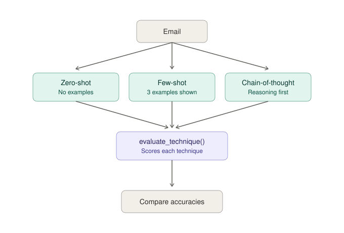

# Prompt Technique Comparison — Gmail Classifier 


## 📌 Overview

This project is implementing prompt engineering techniques (zero-shot, few-shot, chain-of-thought) on Gmail label classifier, built using the Claude API and python

## ✅ What it checks
- Zero-shot — direct instruction to Claude, no examples
- Few-shot — same instruction, with 3 worked examples shown first
- Chain-of-thought — same instruction, but Claude reasons step-by-step before giving its final answer

## 🖼️ Workflow Screenshot




## 🔄 Workflow

1. `prompting_techniques.py ` sends one email's text to Claude and returns a predicted label
2.  It consists of three different functions `classify_zero_shot`, `classify_few_shot` and `classify_CoT`
3. `run_eval_techniques.py` runs the same test emails through all three techniques, using one
   shared `evaluate_technique()` function, and reports each technique's accuracy:
   - Zero-shot accuracy
   - Few-shot accuracy
   - Chain-of-thought accuracy


## 📁 Project Structure

```
prompt-technique-comparison

├── prompting_techniques.py 
├── test_data.py
├── run_eval_techniques.py
├── workflow_screenshot.svg
├── .env
├── README.md
└── requirements.txt

```

## 🛠️ Tech stack
- Python
- Anthropic Claude API(via the `anthropic` Python SDK)
- python-dotenv

## ▶️ How to run it
1. Clone the repo
2. `pip install -r requirements.txt`
3. Add your API key to a `.env` file: `ANTHROPIC_API_KEY=your-key-here`
4. `python run_eval_techniques.py`

## 📊 Sample output

```
[PASS] expected: Bills & Utilities  got: Bills & Utilities
[PASS] expected: Job Alerts  got: Job Alerts
[PASS] expected: Shipping & Orders  got: Shipping & Orders
[PASS] expected: Learning & Courses  got: Learning & Courses
[FAIL] expected: High Priority  got: Bills & Utilities
[PASS] expected: Alerts & Newsletters  got: Alerts & Newsletters
[FAIL] expected: High Priority  got: Job Alerts
[PASS] expected: Bills & Utilities  got: Bills & Utilities
[PASS] expected: Learning & Courses  got: Learning & Courses
[PASS] expected: Shipping & Orders  got: Shipping & Orders
[PASS] expected: Job Alerts  got: Job Alerts
Accuracy: 81.8%
[PASS] expected: Bills & Utilities  got: Bills & Utilities
[PASS] expected: Job Alerts  got: Job Alerts
[PASS] expected: Shipping & Orders  got: Shipping & Orders
[PASS] expected: Learning & Courses  got: Learning & Courses
[PASS] expected: High Priority  got: High Priority
[PASS] expected: Alerts & Newsletters  got: Alerts & Newsletters
[PASS] expected: High Priority  got: High Priority
[PASS] expected: Bills & Utilities  got: Bills & Utilities
[PASS] expected: Learning & Courses  got: Learning & Courses
[PASS] expected: Shipping & Orders  got: Shipping & Orders
[PASS] expected: Job Alerts  got: Job Alerts
Accuracy: 100.0%
[PASS] expected: Bills & Utilities  got: Bills & Utilities
[PASS] expected: Job Alerts  got: Job Alerts
[PASS] expected: Shipping & Orders  got: Shipping & Orders
[PASS] expected: Learning & Courses  got: Learning & Courses
[PASS] expected: High Priority  got: High Priority
[PASS] expected: Alerts & Newsletters  got: Alerts & Newsletters
[FAIL] expected: High Priority  got: Job Alerts
[PASS] expected: Bills & Utilities  got: Bills & Utilities
[PASS] expected: Learning & Courses  got: Learning & Courses
[PASS] expected: Shipping & Orders  got: Shipping & Orders
[PASS] expected: Job Alerts  got: Job Alerts
Accuracy: 90.9%
Zero-shot accuracy: 81.81818181818183
Few-shot accuracy: 100.0
CoT accuracy: 90.9090909090909

```

## 👩‍💻 Author
Swati J 


